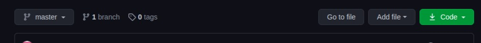
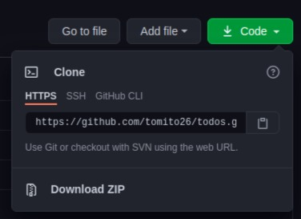

# To Do App
This is an application where users  record their activites at hand and  delete them once done
## Features
* The application has a header with the name of the app and a search input  where users can search for the activities they have recorded
* It has an input where users add their activities
* It also has a list of activitie added by the users with a button for deleteing the activity once done

# Project Setup
The project is accessible on the github  which you can either clone the project or download it. To clone the project you need to copy the repository by clicking on this  green button on github
 
which will show you the project repository and option of downloading  the project


If you chose to download click on download zip then go to your downloads and extract the file and you will have the project on your  local machine

By cloning the project copy the repository link shown then go to your terminal  then follow these commands:
```
$ git clone <project repository>
```
then go to the project  directory using this command
```
$ cd <project directory>
```
to open the project on vscode or atom IDEs
```
$ code ./ atom .
```
And the project is set you then run it on the browsers
## Technologies Used
* HTML5
* CSS3
* Javascript
* Bootstrap4

## Contact
For any enquiry or collaboration feel  free to contact tommybwah@gmail.com

## License and Copyright
Lincensed under [MIT license](license)


